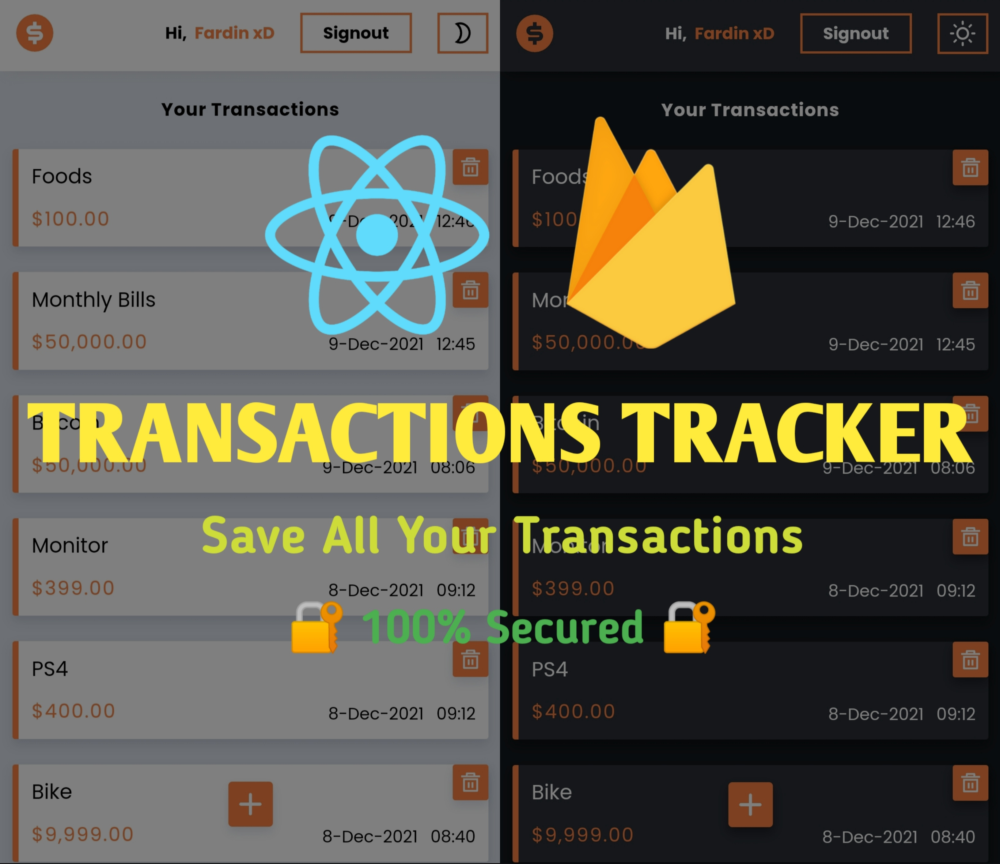

# Transactions Tracker [Live Preview](https://the-transactions-tracker.netlify.app)

## `Before running this project on your machine`

1. Create .env file in the project folder
2. Copy the following text and paste in .env file

REACT_APP_FIREBASE_API_KEY=PasteYourFirebaseConfigHere

REACT_APP_FIREBASE_AUTH_DOMAIN=PasteYourFirebaseConfigHere

REACT_APP_FIREBASE_PROJECT_ID=PasteYourFirebaseConfigHere

REACT_APP_FIREBASE_STORAGE_BUCKET=PasteYourFirebaseConfigHere

REACT_APP_FIREBASE_MSG_SENDER_ID=PasteYourFirebaseConfigHere

REACT_APP_FIREBASE_APP_ID=PasteYourFirebaseConfigHere

## `Run the following command to start the project`

1. yarn
2. yarn start

## `Connect With Me`

